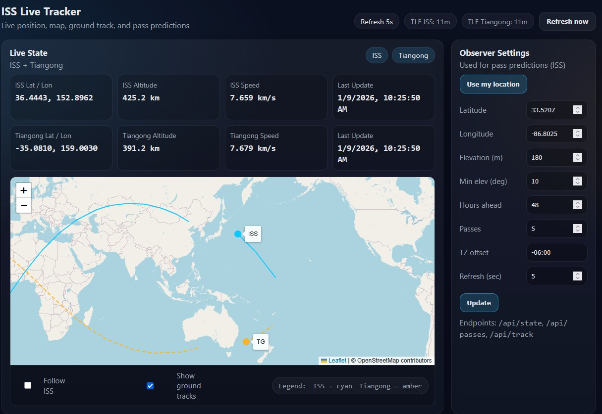
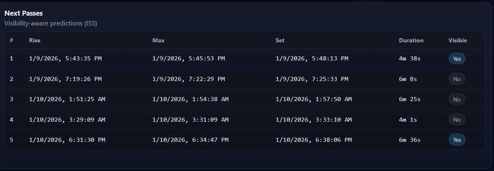

# ISS Live Tracker


[](LICENSE)

A lightweight, Dockerized web dashboard for the **International Space Station (ISS)** and **China's Tiangong (CSS)** which provides live tracking, ground tracks, and observer-based pass visibility predictions (ISS only).

This project provides a self-hosted web interface that shows the ISS’s real-time position, predicted ground track, and upcoming passes from a chosen observer location, including a visibility heuristic based on lighting conditions.

---

## Why Tiangong?

Tiangong (TG) is included to demonstrate multi-satellite LEO tracking and comparative orbital visualization.

This elevates the project from an ISS-only viewer into a reusable satellite tracking framework.

---

## Features

- **Live satellite state (ISS + Tiangong)**
  - Latitude / longitude
  - Altitude and orbital speed
  - Auto-refreshing state display
  - TLE age indicators

- **Interactive world map**
  - Live markers for ISS and Tiangong
  - Forward ground-track projections
    - ISS: solid cyan line
    - Tiangong: dashed amber line
  - Follow ISS toggle
  - Optional ground track visibility

- **Pass predictions (ISS only)**
  - Observer-based rise, max, and set times
  - Duration formatted as minutes and seconds
  - Visibility estimation based on observer darkness and satellite illumination

- **Modern dashboard UI**
  - Dark theme optimized for night viewing
  - Responsive layout
  - Vanilla JS + Leaflet (no frameworks)

- **Docker-first deployment**
  - Runs on Raspberry Pi (ARM64) and x86_64
  - Stateless container
  - Ephemeris data bundled for fast startup


---

## Screenshots





---

## Quick Start (Docker – Recommended)

### Pull the image

```bash
docker pull amcannally/iss-live-tracker:2.0
```

### Run the container

```bash
docker run -d \
  --name iss-live-tracker \
  --restart unless-stopped \
  -p 5000:5000 \
  amcannally/iss-live-tracker:latest
```

Open in your browser:

```
http://<host-ip>:5000/
```

---

## Docker Compose (Optional)

```yaml
services:
  iss-live-tracker:
    image: amcannally/iss-live-tracker:2.0
    container_name: iss-live-tracker
    restart: unless-stopped
    ports:
      - "5000:5000"
    environment:
      - TZ=America/Chicago
```

Start it:

```bash
docker compose up -d
```

---

## Running From Source (Development)

### Requirements

- Python 3.11+
- Internet access (for TLE updates and map tiles)

### Setup

```bash
git clone https://github.com/amcanna1ly/iss-live-tracker.git
cd iss-live-tracker

python3 -m venv venv
source venv/bin/activate
pip install -r requirements.txt
```

### Run

```bash
python iss_web.py
```

Open:

```
http://127.0.0.1:5000/
```

---

## Configuration Notes

- **TLE data** is fetched from Celestrak and cached in memory.
- **Ephemeris data (`de421.bsp`)** is required for Sun/visibility calculations.
  - When using Docker, this is downloaded at build time.
- **Map tiles** are served from OpenStreetMap (internet required).

---

## API Endpoints

### GET /api/state

Returns the current orbital state for all tracked satellites.

### GET /api/track

Returns predicted forward ground tracks for ISS and Tiangong.

### GET /api/passes

Returns observer-based ISS pass predictions.

---

## Architecture

- **Backend:** Flask, Skyfield, SGP4
- **Frontend:** Vanilla HTML/CSS/JS, Leaflet
- **Data Sources:** Celestrak, JPL DE421, OpenStreetMap

---

## Project Structure

    iss-live-tracker/
    ├── Dockerfile
    ├── LICENSE
    ├── README.md
    ├── docker-compose.yml
    ├── docs/
    │   ├── ISS-Live-Tracker_DashboardView.jpg
    │   └── ISS-Live-Tracker_NextPassTable.jpg
    ├── iss_web.py
    ├── requirements.txt
    ├── static/
    │   ├── app.css
    │   └── app.js
    └── templates/
        └── index.html

---

## Raspberry Pi Notes

- Tested on Raspberry Pi 5 (ARM64)
- Runs comfortably on low-resource hardware

---

## License

MIT License.

---

## Acknowledgements

- Celestrak – ISS TLE data
- Skyfield – orbital mechanics and ephemeris
- OpenStreetMap – map tiles
